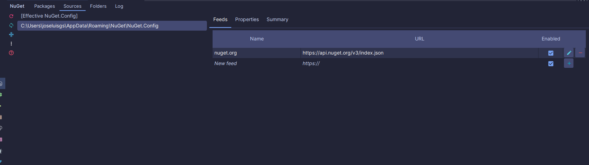

# C# Local and Remote


- [C# Local and Remote](#c-local-and-remote)
  - [Acerca de](#acerca-de)
  - [Programación asíncrona y reactiva](#programación-asíncrona-y-reactiva)
  - [Railway Oriented Programming](#railway-oriented-programming)
  - [Almacenamiento y Serialización](#almacenamiento-y-serialización)
  - [Cache en Memoria](#cache-en-memoria)
  - [Repositorio Local](#repositorio-local)
  - [Repositorio Remoto](#repositorio-remoto)
  - [Validador](#validador)
  - [Notificaciones](#notificaciones)
  - [Servicio](#servicio)
  - [Test](#test)
  - [Inyección de Dependencias](#inyección-de-dependencias)
  - [Lectura de parámetros de configuración](#lectura-de-parámetros-de-configuración)


## Acerca de

Este proyecto es un ejemplo de como crear un servicio para el almacenamiento de datos C#.

Tendremos un repositorio local usando una base de datos, y un repositorio remoto utilizando una API REST.

Ambos repositorios estarán encapsulados en un solo servicio, que será el que utilicemos en nuestra aplicación.
Es decir, cada cierto tiempo se actualizará la base de datos local con los datos de la API REST. Otro caso de uso es que
no haya conexión, o simplemente
queramos trabajar con los datos locales o si no se encuentran actualizados, con los datos de la API REST.
Además, otra caché en memoria se encargará de almacenar los últimos datos obtenidos de la base de datos local o de la
API REST para mejorar el rendimiento de la aplicación. Es decir, si la base de datos local no está actualizada, se
obtendrán los datos de la API REST cada cierto intervalo de refresco y se almacenarán en la base de datos local. En la
caché
en memoria se almacenarán los últimos datos obtenidos de la base de datos local o de la API REST.

El intervalo de refresco de la base de datos local y el de la caché en memoria se puede configurar.

Por otro lado, el servicio podrá importar/exportar datos en CSV y JSON.

Finalmente, tendremos un servicio de notificaciones, que nos permitirá recibir información de los cambios realizados.

El objetivo docente es mostrar implementaciones asíncronas y reactiva en el procesamiento de la información.

Puedes seguir el proyecto en [GitHub](https://github.com/joseluisgs/CSharpLocalAndRemote) y en los commits indicados.

```
El proyecto está sobre-exagerado para mostrar diferentes técnicas y no es un ejemplo de cómo hacer una aplicación real.
Se trata de elementos aislados que se pueden utilizar en una aplicación real con el objetivo que el alumnado identifique
y asimile nuevas técnicas y herramientas de programación. No tiene que ser la mejor forma ni la más eficiente, pero sí
intenta acercar otras formas de programar nuevas que se están viendo en clase. El objetivo es aprender y no hacer una
aplicación real y eficiente. 
```

La idea subyacente es el famoso patrón de diseño Repository usado en Android, pero llevado a un nivel superior.


## Programación asíncrona y reactiva

La
programación [asíncrona](https://sunscrapers.com/blog/programming-async-vs-sync-best-approach/)
es un modelo de programación que permite realizar tareas en segundo plano sin bloquear el hilo
principal de
la aplicación.
La [reactividad](https://www.baeldung.com/cs/reactive-programming#:~:text=Reactive%20programming%20is%20a%20declarative,or%20reactive%20systems%20in%20general.)
es un modelo de programación que permite reaccionar a eventos de forma rápida y eficiente.
La programación reactiva es un paradigma de programación declarativa que se basa en la idea del procesamiento asíncrono
de eventos y flujos de datos.

En C#, la programación asíncrona y reactiva se puede realizar
con [Async/Await](https://learn.microsoft.com/es-es/dotnet/csharp/asynchronous-programming/)
y [IAsyncEnumerable y Linq](https://learn.microsoft.com/es-es/shows/on-net/supporting-iasyncenumerable-with-linq) y [Task](https://learn.microsoft.com/en-us/dotnet/api/system.threading.tasks.task?view=net-8.0)
Con Async/Await se pueden realizar tareas en segundo plano de forma sencilla y eficiente. Con IAsyncEnumerable y Linq se
pueden realizar operaciones asíncronas de forma sencilla y eficiente.

A lo largo del proyecto también usaremos [RxNet](https://reactivex.io/), que es una librería que nos permite trabajar con
programación reactiva de forma sencilla y eficiente. Sobre todo en las notificaciones.

¿Podríamos pensar cuál es mejor para este proyecto?
- `Task<T>` es parte de la biblioteca estándar de tareas asincrónicas en .NET y es ideal para modelar operaciones asincrónicas que se completan una vez (one-time events).
- `IObservable<T>` es parte de Reactive Extensions (Rx), y es adecuado para trabajar con flujos de datos continuos o múltiples elementos emitidos a lo largo del tiempo.

Recomendaciones:
- Flujos de Datos Continuos o Múltiples Emisiones: Si tu aplicación se beneficia del manejo de eventos o flujos de datos continuos, IObservable<T> es la mejor opción.
- Operaciones Discretas y Puntuales: Para operaciones que se completan una sola vez y no se emiten múltiples valores en el tiempo, Task<T> sigue siendo el camino más simple y directo

Esto es parecido a las dudas que hemos tenido en otros proyectos en Kotlin y Java
- Kotlin: async/await vs Flows
- Java: CompletableFuture vs Project Reactor


## Railway Oriented Programming

El [Railway Oriented Programming](https://fsharpforfunandprofit.com/rop/) (ROP) es un estilo de programación que se basa
en el uso de funciones que devuelven un
resultado. De esta manera, se pueden encadenar operaciones de forma sencilla y eficiente. En C#, el ROP se puede
realizar con la clase Result. La clase Result es una clase que representa un resultado exitoso o un resultado fallido.
De
esta manera, se pueden realizar operaciones de forma sencilla y eficiente.

Para ello debemos instalar las extensiones funcionales de C#.

```bash
dotnet add package CSharpFunctionalExtensions
```

Para ello debemos entender que es el Happy Path y el Error Path. El Happy Path es el camino feliz, es decir, el camino
que se espera que se siga. El Error Path es el camino de error, es decir, el camino que se sigue cuando se produce un
error.

De esta manera podemos encadenar operaciones de forma sencilla y eficiente. Si una operación falla, se sigue el Error
Path. Si una operación tiene éxito, se sigue el Happy Path.

## Almacenamiento y Serialización

El primer paso es crear un servicio de almacenamiento y serialización de datos para realizar las operaciones de lectura
y escritura de datos. Para ello, crearemos una interfaz `StorageService` que definirá las operaciones de lectura y
escritura.

Luego, crearemos una implementación de esta interfaz para almacenar los datos en formatos CSV y JSON.
Para facilitar la serialización y deserialización de los datos, utilizaremos la librería de
Kotlin [Newtonsoft.Json (también conocida como Json.NET)](https://www.newtonsoft.com/json).

Lo primero que debemos hacer es instalar la librería de Newtonsoft.Json.

```bash
dotnet add package Newtonsoft.Json
```

Haremos uso de mapeadores para convertir los datos de un formato a otro. Para ello haremos uso de las [funciones de
extensión de C#](https://learn.microsoft.com/es-es/dotnet/csharp/programming-guide/classes-and-structs/extension-methods). Estas funciones nos permiten añadir nuevas
funcionalidades a las clases sin modificarlas. En este
caso añadiremos
funciones de extensión para convertir los datos de un formato a otro.

En todo momento trabajaremos la asincronía con [Task]https://learn.microsoft.com/en-us/dotnet/api/system.threading.tasks.task?view=net-8.0) y trabajaremos ROP con
[Result](https://github.com/vkhorikov/CSharpFunctionalExtensions).

Como logger hemos usado Serilog, que es un logger muy potente y sencillo de usar. Para instalarlo debemos hacerlo de la 
siguiente forma:

```bash
dotnet add package Serilog
dotnet add package Serilog.Sinks.Console
dotnet add package Serilog.Extensions
```

Enlace a
los [commit de la sección](https://github.com/joseluisgs/CSharpLocalAndRemote/tree/23b2b10da417b9ad80cec06bed4dea80dfc5fc2b).

## Cache en Memoria

Para realizar la caché en memoria, crearemos una interfaz genérica `Cache` que definirá las operaciones de lectura y
escritura de datos.

Ene ste momento tenemos dos alternativas: FIFO y LRU.

- FIFO: First In First Out, es decir, el primer elemento que entra es el primero en salir. Como ventajas es más sencillo
  de implementar, no necesita de un contador de accesos ni de un contador de tiempo. Como desventajas no tiene en cuenta
  la frecuencia de uso de los elementos, ni el tiempo de uso de los elementos, ni la importancia de los elementos.
- LRU: Least Recently Used, es decir, el elemento menos recientemente usado es el primero en salir. Como ventajas tiene
  en cuenta la frecuencia de uso de los elementos, el tiempo de uso de los elementos y la importancia de los elementos.
  Como desventajas es más complejo de implementar, necesita de un contador de accesos y de un contador de tiempo.

Para la implementación de la caché en memoria con LRU usaremos un truco si conoces bien las colecciones
como `Dictionary<K, LinkedListNode<(K key, T value)>> _cacheMap;` que nos permite tener acceso a los elementos de forma
rápida y eficiente y `LinkedList<(K key, T value)> _cacheList;` que nos permite tener acceso a los elementos de forma por orden de acceso.

Combinando ambas estructuras de datos, podemos implementar una caché en memoria con LRU de forma sencilla y eficiente.


Enlace a
los [commit de la sección](https://github.com/joseluisgs/CSharpLocalAndRemote/tree/060be6ad2f1125ee52645dd904dafa88ecb384e2).

## Repositorio Local

Para la realización del repositorio local, hemos usado [Entity Framework](https://learn.microsoft.com/en-us/ef/core/),
que es un ORM (Object-Relational Mapping) que nos permite trabajar con bases de datos de forma sencilla y eficiente.

Para ello debemos tener en cuenta dos objetos claves:
- DbContext: Es el objeto que representa la base de datos. Contiene las tablas y las relaciones entre las tablas.
- DbSet: Es el objeto que representa una tabla. Contiene los registros de la tabla.

A la hora de mappear las tablas, podemos hacer uso de [Data Annotations](https://learn.microsoft.com/en-us/ef/core/modeling/data-annotations) y de [Fluent API](https://learn.microsoft.com/en-us/ef/core/modeling/).

En nuestro caso hemos usado las dos variantes para mostrar ambas formas de mapear las tablas, una para unos casos y otra para otros.

A su vez, gracias al uso de Entity Framework, podemos realizar operaciones asíncronas de forma sencilla y eficiente.

En nuestro caso hemos instalado las dependencias necesarias para trabajar con SQLite.

```bash
dotnet add package Microsoft.EntityFrameworkCore
dotnet add package Microsoft.EntityFrameworkCore.Sqlite
```

Enlace a
los [commit de la sección](https://github.com/joseluisgs/CSharpLocalAndRemote/tree/fc76a44c7908b4c8d648dd149f8c59135649b024).


## Repositorio Remoto

Para la realización del repositorio remoto, hemos usado [Refit](https://reactiveui.github.io/refit/), una librería que
nos
permite realizar peticiones a
una API REST de forma sencilla y eficiente. Además, le hemos añadido las opciones para parsear los datos con Newtonsoft.Json y el
manejo asincronía con Task

Para ello, hemos creado una interfaz para definir las operaciones de la API REST y una implementación de un repositorio
donde
usando Refit realizamos las peticiones a la API REST.

Una de las ventajas de Refit es que nos permite definir las operaciones de la API REST.

Para instalarlo debemos hacerlo de la siguiente forma:

```bash
dotnet add package Refit
dotnet add package Refit.Newtonsoft.Json
```

Enlace a
los [commit de la sección](https://github.com/joseluisgs/CSharpLocalAndRemote/tree/298eb8f7fe618df932b27544909539869084172b).

Para la realización del validador de datos, hemos usado métodos de extensión de C# que nos permite validar los
datos de forma sencilla y eficiente.

Enlace a
los [commit de la sección](https://github.com/joseluisgs/CSharpLocalAndRemote/tree/850a43b577bbe95d7d08e5b84e0a51887a22996a).

## Validador

Para la realización del validador de datos, hemos usado una función de extensión de C# que nos permite validar los
datos de forma sencilla y eficiente.

Enlace a
los [commit de la sección](https://github.com/joseluisgs/CSharpLocalAndRemote/tree/850a43b577bbe95d7d08e5b84e0a51887a22996a).


## Notificaciones

Para la realización del servicio de notificaciones, hemos hecho uso de la librería Rx.NET, que nos permite trabajar con
programación reactiva de forma sencilla y eficiente.

Para ello usaremos el patrón Observer, que nos permite notificar a los observadores de los cambios realizados.

Lo primero es usar la librería de Rx.NET.

```bash
dotnet add package System.Reactive
```

Luego definiremos `BehaviorSubject` que nos permitirá almacenar el último valor emitido y notificar a los observadores. 
Por muchos observadores que tengamos, todos recibirán la última notificación. Usamos skip para no recibir el primer valor, pues es nulo.

Posteriormente, devolvemos el observable para que los observadores se suscriban a él.

`BehaviorSubject` almacena el último valor emitido y lo retransmite a cualquier nuevo observador que se suscriba. 
Esto convierte a BehaviorSubject en un tipo de observable "caliente" (hot observable). 
Todos los observadores obtenidos recibirán inmediatamente el último valor emitido, independientemente de cuándo se suscriban. 
Además, el observable sigue emitiendo valores incluso cuando no hay ningún observador suscrito.

No tiene nada que ver con `Observer.create`, que es un observable "frío" (cold observable) que emite valores solo cuando hay un observador suscrito y
emite los valores desde el principio.

Enlace a
los [commit de la sección](https://github.com/joseluisgs/CSharpLocalAndRemote/tree/e82b41a78982661a0153ef65336cb38a8bf48202).

El siguiente paso es crear un servicio que encapsule los repositorios local y remoto y la caché en memoria. Para ello,
crearemos una interfaz `Service` que definirá las operaciones de lectura y escritura de datos.

De esta manera, podremos utilizar el servicio en nuestra aplicación para almacenar y recuperar los datos de forma
sencilla y eficiente.

Enlace a
los [commit de la sección](https://github.com/joseluisgs/CSharpLocalAndRemote/tree/42f96880bc8faceaf1bd95aa6ee24c943b26a4f2).

## Servicio

El siguiente paso es crear un servicio que encapsule los repositorios local y remoto y la caché en memoria. Para ello,
crearemos una interfaz `Service` que definirá las operaciones de lectura y escritura de datos.

De esta manera, podremos utilizar el servicio en nuestra aplicación para almacenar y recuperar los datos de forma
sencilla y eficiente.

Enlace a
los [commit de la sección](https://github.com/joseluisgs/CSharpLocalAndRemote/tree/0ab2ea29428d0a8de364437b840eb326e2b851e0).


## Test

A la hora de realizar los tests, hemos usado [NUnit](https://nunit.org/), pero antes de nada asegurate de seguir los pasos en:
[Getting Started with NUnit](https://www.jetbrains.com/help/rider/Getting_Started_with_Unit_Testing.html#step-1-add-unit-test-project)
y configura tu proyecto para que use NUnit.
Para ello en tu directorio de usuario crea un archivo `nuget.config` con el siguiente contenido:

```xml
<?xml version="1.0" encoding="utf-8"?>
<configuration>
  <packageSources>
    <add key="nuget.org" value="https://api.nuget.org/v3/index.json" protocolVersion="3" />
    </packageSources>
</configuration>
```

O desde Rider, ve a NuGet y configura el origen de los paquetes.


Ahora ya puedes instalar NUnit en tu proyecto.

```bash
dotnet add package NUnit
```

Lo mejor es es crear un proyecto de pruebas unitarias en tu solución y añadir los tests allí. Automáticamente tendrás 
las referencias necesarias.

```xml
<ItemGroup>
        <PackageReference Include="coverlet.collector" Version="6.0.0"/>
        <PackageReference Include="Microsoft.NET.Test.Sdk" Version="17.8.0"/>
        <PackageReference Include="NUnit" Version="3.14.0"/>
        <PackageReference Include="NUnit.Analyzers" Version="3.9.0"/>
        <PackageReference Include="NUnit3TestAdapter" Version="4.5.0"/>
    </ItemGroup>
```

A la hora de testear repositorios se ha seguido las guía de [Testing EF Core Applications](https://learn.microsoft.com/en-us/ef/core/testing/), al movernos 
en una base de datos relacional, lo lógico es que sigamos con SQLite en memoria. Recuerda que para configurar el test debes abrir y cerrar la conexión a la base de datos.

A la hora de testear el servicio, hemos usado mocks para simular el comportamiento de los repositorios y de la caché en con los mocks de [Moq](https://github.com/devlooped/moq).
  
  ```bash
  dotnet add package Moq
  ```

## Inyección de Dependencias

Para la inyección de dependencias hemos usado `HostBuilder`. HostBuilder es una parte fundamental de la infraestructura de aplicaciones basadas en el runtime de host genérico proporcionado por .NET Core. Es una clase que proporciona un mecanismo para configurar y construir el runtime de host en el que se ejecuta la aplicación. Nos aporta:
- Configuración de la Aplicación: El HostBuilder es responsable de configurar aspectos como la configuración de la aplicación, los servicios y la lógica necesaria para arrancar y detener la aplicación.
- Inyección de Dependencias: Facilita la configuración de la inyección de dependencias en la aplicación, lo que permite registrar y resolver servicios necesarios para el funcionamiento de la aplicación, para ello usaremos `GetRequiredService<T>()`.
- Bootstrapping de la Aplicación: Prepara toda la infraestructura necesaria para que la aplicación se ejecute correctamente, como la configuración del entorno, la configuración del logging, la configuración del manejo de excepciones, entre otros.

Debemos instalar:
```bash
dotnet add package Microsoft.Extensions.Hosting
dotnet add package Microsoft.Extensions.DependencyInjection
```

Enlace a
los [commit de la sección](https://github.com/joseluisgs/CSharpLocalAndRemote/tree/05ff945e023a168f92bc3ccf051b24c68845091c).

## Lectura de parámetros de configuración
Usaremos el fichero de propiedades `appsettings.json` para leer los parámetros de configuración. Para ello, hemos creado distintas clases Settings con las que vamos a 
encapsular los parámetros de configuración. Para ello, hemos usado la librería de [Microsoft.Extensions.Configuration](https://docs.microsoft.com/en-us/dotnet/api/microsoft.extensions.configuration?view=dotnet-plat-ext-6.0).

```bash
dotnet add package Microsoft.Extensions.Configuration
dotnet add package Microsoft.Extensions.Configuration.Json
```